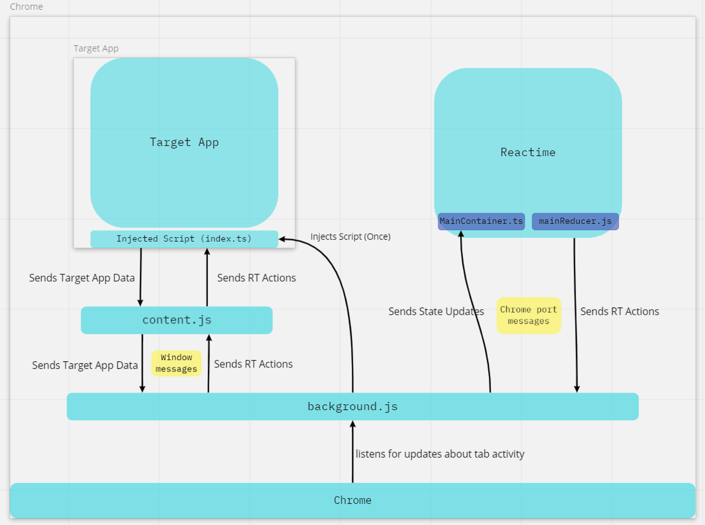
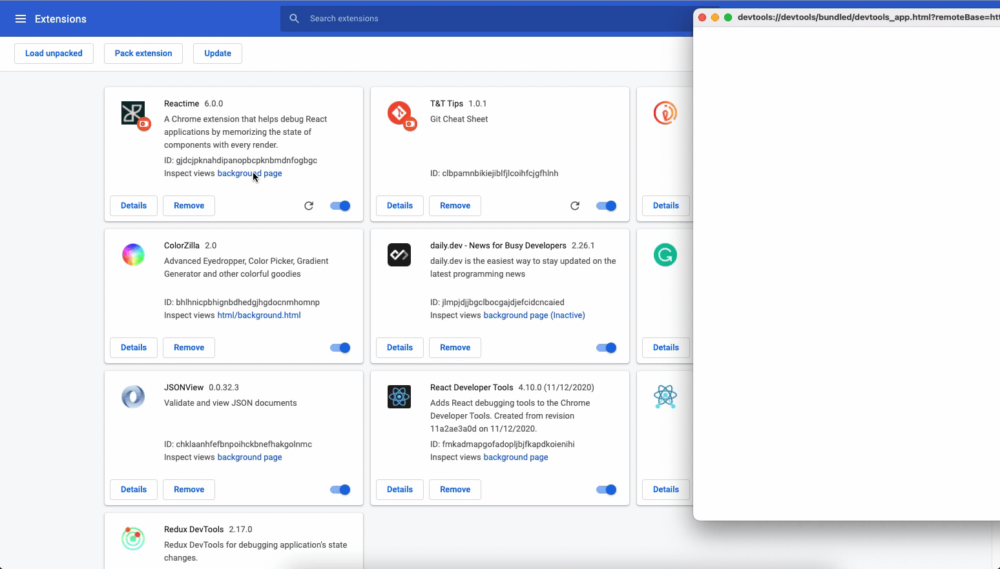
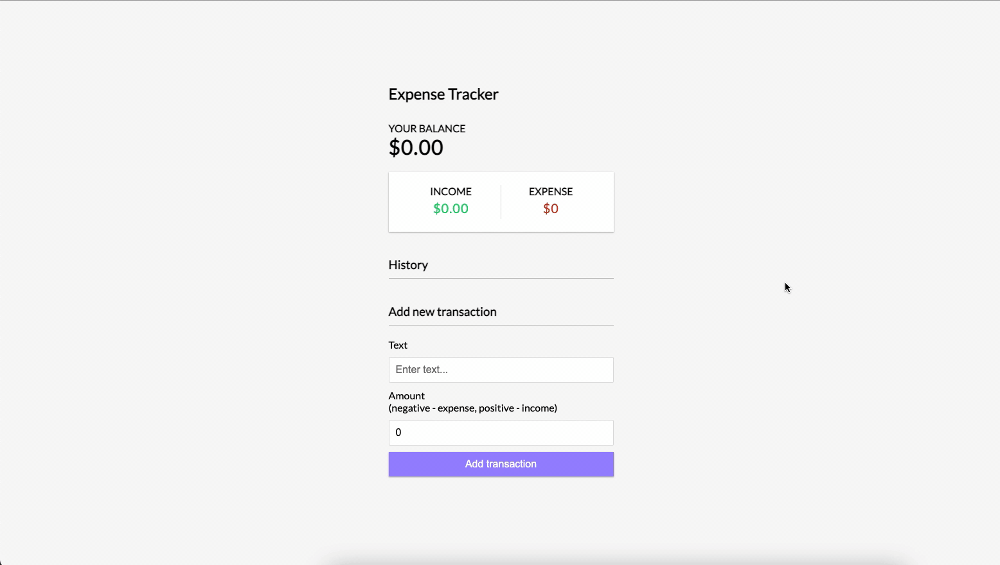

# Developer README

## Brief

Our mission at Reactime is to maintain and iterate constantly, but never at the expense of future developers.<br />We know how hard it is to quickly get up to speed and onboard in a new codebase.<br />So, here are some helpful pointers to help you hit the ground running. 🏃🏾💨

## Building from source

1. If you have already installed Reactime from the Chrome Web Store, disable or uninstall it.
2. Run `yarn` to install all dependencies.
3. Run `yarn dev`. This will start a `webpack` process which watches for file changes and whenever it sees some, automatically rebuilds the webpack bundles used by the extension.
4. Go to `chrome://extensions`
5. Ensure Developer mode is enabled
6. Click `Load unpacked`
7. Select the `src/extension/build` directory

Now you should be able to change Reactime code and see the changes instantly reflected in your browser!

<b>With release of Node v18.12.1 (LTS) on 11/4/22, the script has been updated to 'npm run dev' | 'npm run build' for backwards compatibility.<br/>
For version Node v16.16.0, please use script 'npm run devlegacy' | 'npm run buildlegacy'</b>

## Quick Tips

- _Before_ beginning development, especially on teams, make sure to configure your linter and code formatting to conform to one unified setting (We recommend [the Airbnb style guide](https://github.com/airbnb/javascript)!) This will make reviewing PRs much more readable and less error-prone.

## File Structure

In the _src_ folder, there are three directories we care about: _app_, _backend_, and _extension_.

```
src/
├── app/                          # Frontend code
│   ├── __tests__/                #
│   ├── actions/                  # Redux action creators
│   ├── components/               # React components
│   ├── constants/                #
│   ├── containers/               # More React components
│   ├── reducers/                 # Redux mechanism for updating state
│   ├── styles/                   #
│   ├── index.tsx                 # Starting point for root App component
│   ├── module.d.ts               #
│   └── store.tsx                 #
│
├── backend/                      # "Backend" code (injected into target app)
│   │                             # Focus especially on linkFiber, timeJump, tree, and helpers
│   ├── __tests__/                #
│   ├── controllers/              #
│       ├── createComponentActionsRecord.ts #
│       ├── createTree.ts         #
│       ├── statePropExtractor.ts #
│       ├── throttle.ts           #
│       ├── timeJump.ts           # Rerenders DOM based on snapshot from background script
│   ├── models/
│       ├── filterConditions.ts   #
│       ├── masterState.ts        # Component action record interface
│       ├── routes.ts             # Interfaces with the browser history stack
│       ├── tree.ts               # Custom structure to send to background
│   ├── routers/
│       ├── linkFiber.ts          #
│       ├── snapShot.ts           #
│   ├── types/                    # Typescript interfaces
│   ├── index.ts                  # Starting point for backend functionality
│   ├── index.d.ts                # Definitely Type file for Index
│   ├── module.d.ts               #
│   ├── package.json              #
│   ├── puppeteerServer.js        #
│
├── extension/                    # Chrome Extension code
│   ├── build/                    # Destination for bundles and manifest.json (Chrome config file)
│   │                             #
│   ├── background.js             # Chrome Background Script
│   └── contentScript.ts          # Chrome Content Script
└──
```

1. The _app_ folder is responsible for the Single Page Application that you see when you open the chrome dev tools under the Reactime tab.


2. The _backend_ folder contains the set of all scripts that we inject into our "target" application via `background.js`
   - In Reactime, its main role is to generate data and handle time-jump requests from the background script in our _extension_ folder.


3. The _extension_ folder is where the `contentScript.js` and `background.js` are located.
   - Like regular web apps, Chrome Extensions are event-based. The background script is where one typically monitors for browser triggers (e.g. events like closing a tab, for example). The content script is what allows us to read or write to our target web application, usually as a result of [messages passed](https://developer.chrome.com/extensions/messaging) from the background script.
   - These two files help us handle requests both from the web browser and from the Reactime extension itself

## Diagramming

All the diagrams of data flows are avaliable on [MIRO](https://miro.com/app/board/o9J_lejUqLQ=/)

## Data Flow Architecture

The general flow of data is described in the following steps:



1. When the background bundle is loaded by the browser, it executes a script injection into the dom. (see section on _backend_). This script uses a technique called [throttle](https://medium.com/@bitupon.211/debounce-and-throttle-160affa5457b) to send state data from the app to the content script every specified milliseconds (in our case, this interval is 70ms).

2. The content script always listens for messages being passed from the extension's target application. Upon receiving data from the target app, the content script will immediately forward this data to the background script which then updates an object called `tabsObj`. Each time `tabsObj` is updated, its latest version will be passed to Reactime, where it is processed for displaying to the user by the _app_ folder scripts.

3. Likewise, when Reactime emits an action due to user interaction -- a "jump" request for example -- a message will be passed from Reactime via the background script to the content script. Then, the content script will pass a message to the target application containing a payload that represents the state the user wants the DOM to reflect or "jump" to.
   - One important thing to note here is that this jump action must be dispatched in the target application (i.e. _backend_ land), because only there do we have direct access to the DOM.

## Console.log

Navigation between different console.log panels can be confusing when running Reactime. We created a short instruction where you can find the results for your console.log

### <b> /src/extension </b>

Console.logs from the Extension folder you can find here:

- Chrome Extension (Developer mode)
- Background page



### <b> /src/app </b>

Console.logs from the App folder you can find here:

- Chrome Browser
- Inspect



### <b> /src/backend </b>

Console.logs from the App folder you can find here:

- Open the Reactime extension in Chrome
- Click "Inspect" on Reactime


## Chrome Developer Resources

Still unsure about what content scripts and background scripts do for Reactime, or for a chrome extensions in general?

- The implementation details [can be found](./extension/background.js) [in the source files](./extension/contentScript.ts) themselves.
- We also encourage you to dive into [the official Chrome Developer Docs](https://developer.chrome.com/home).

Some relevant sections are reproduced below:

> Content scripts are files that run in the context of web pages.
>
> By using the standard Document Object Model (DOM), they are able to **read** details of the web pages the browser visits, **make changes** to them and **pass information back** to their parent extension. ([Source](https://developer.chrome.com/extensions/content_scripts))

- One helpful way to remember a content script's role in the Chrome ecosystem is to think: a _content_ script is used to read and modify a target web page's rendered _content_.

> A background page is loaded when it is needed, and unloaded when it goes idle.
>
> Some examples of events include:
> The extension is first installed or updated to a new version.
> The background page was listening for an event, and the event is dispatched.
> A content script or other extension sends a message.
> Another view in the extension, such as a popup, calls `runtime.getBackgroundPage`.
>
> Once it has been loaded, a background page will stay running as long as it is performing an action, such as calling a Chrome API or issuing a network request.
>
> Additionally, the background page will not unload until all visible views and all message ports are closed. Note that opening a view does not cause the event page to load, but only prevents it from closing once loaded. ([Source](https://developer.chrome.com/extensions/background_pages))

- You can think of background scripts serving a purpose analogous to that of a **server** in the client/server paradigm. Much like a server, our `background.js` listens constantly for messages (i.e. requests) from two main places:
  1. The content script
  2. The chrome extension "front-end" **(_NOT_ the interface of the browser, this is an important distinction.)**
- In other words, a background script works as a sort of middleman, directly maintaining connection with its parent extension, and acting as a proxy enabling communication between it and the content script.
